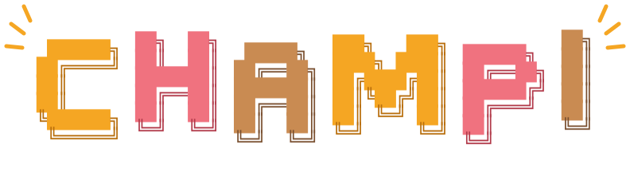

<p align="center">
  
  
</p>

CHAMPI is a native Linux virtual instrument that runs the real
[CHOMPI](https://github.com/CHOMPI-Club/CHOMPI) TAPE firmware on x86.

The CHOMPI is a discontinued, MIT-licensed sampler built on a Daisy Seed (STM32H750,
libDaisy/DaisySP). CHAMPI doesn't rewrite the firmware. It compiles the original firmware sources,
unchanged, against a host version of libDaisy's hardware layer. The firmware then runs on a
"virtual chip" that gives it emulated keys, encoders, LEDs, an SD card, audio and MIDI.

## Status

Early work: the real TAPE firmware runs on daisycola's virtual MCU, from a virtual SD card, with
the CHOMPI board model (panel wiring, battery charger, LED layout) around it. `champi` plays it
through JACK or PipeWire with MIDI in and out, on a vector panel laid out from the board files and
played with the mouse or the computer keyboard. `champi-headless` plays
it from a script and records the audio and LEDs. The work is split into chunks, each ending in
something that builds and has tests. Progress is tracked in
[docs/planning/OVERALL_PLAN.md](docs/planning/OVERALL_PLAN.md).

## Planned features

- An on-screen panel styled after the original instrument, drawn as vectors with live LEDs.
- Play it with the mouse, the computer keyboard (configurable keymap), or any number of MIDI
  controllers.
- A standalone JACK app (also works under PipeWire), built with
  [DPF](https://github.com/DISTRHO/DPF). LV2/VST3/CLAP plugins can come later from the same code.
- A virtual SD card stored as a disk-image file, seeded with the factory TAPE card content, with
  import and export.
- TAPE first. TEMPO and WAVE may follow.

## Planned layout

```
third_party/CHOMPI/    submodule: CHOMPI firmware, card profiles and board files (never patched)
third_party/daisycola/ submodule: libDaisy replacement and virtual MCU
third_party/DPF/       submodule: DISTRHO Plugin Framework
core/                  firmware build, CHOMPI board model, runtime glue
app/                   DPF app and panel UI
tools/                 champi-headless, panel layout extractor
tests/
docs/                  design and planning documents
```

## Building

You need gcc, CMake 3.20 or newer, access to the private daisycola repo, and the development
packages for JACK, libsamplerate, OpenGL and X11. The build compiles the TAPE firmware and builds
`champi` and `champi-headless`.

```sh
git clone --recurse-submodules git@github.com:pablo-penovi/CHAMPI.git
cd CHAMPI
cmake -B build
cmake --build build
```

In an existing clone, run `git submodule update --init --recursive` first. Run the tests with
`ctest --test-dir build`. For a ThreadSanitizer or AddressSanitizer build, configure a separate
build directory with `-DCHAMPI_SANITIZER=thread` or `-DCHAMPI_SANITIZER=address`.

## Running the app

```sh
build/bin/champi
```

`champi` is a standalone JACK client named `CHAMPI`. Under PipeWire, `pipewire-jack` provides the
JACK library, so no JACK server is needed. It has three inputs (`mic`, `line_l`, `line_r`), four
outputs (`master_l`, `master_r`, `phones_l`, `phones_r`), a MIDI input (`events-in`) and a MIDI
output (`midi-out`). At start it connects master out to the first two playback ports and every
hardware MIDI source to its MIDI input; `--no-connect` turns that off. More controllers can be
connected in qpwgraph or with `pw-link`. They all reach the firmware as its TRS MIDI input, on the
channel set in `options.json` (channel 1 on the factory card).

The firmware runs at 48 kHz. At other rates the audio is resampled with libsamplerate, which adds a
little latency, so it's better to run the graph at 48 kHz. For a 64-frame buffer:

```sh
PIPEWIRE_QUANTUM=64/48000 build/bin/champi
```

The panel is laid out from the CHOMPI board files and plays by mouse or keyboard. With the mouse:

- Click and hold a key to play it.
- Drag an encoder up or down to turn it (up is clockwise), or scroll over it. Click it to push it;
  hold the button still for a moment to keep it pushed, then drag to turn it while pushed.
- Click the toggle switch to flip it (lever up is on), and the jack at the right edge to plug or
  unplug line in. Without a plug the firmware records from the mic.

From the keyboard, by default:

| Keys | Panel |
|---|---|
| `Z X C V B N M`, `Q W E R T Y U I` | white keys 1–7 and 8–15 |
| `S D G H J`, `2 3 5 6 7` | the black keys, as on a tracker |
| `Tab`, `Space`, `Enter` | CHOMPI, play, loop |
| `F1`–`F6` | select an encoder, left to right (`F1` is the speed knob, `F5` the scrub wheel) |
| `←` `→` or `[` `]` | turn the selected encoder (hold to keep turning) |
| `\` | push the selected encoder while held |
| `` ` ``, `F12` | flip the toggle switch, plug or unplug line in |

The keys are physical, named as on a US keyboard: on other layouts they're the keys in the same
places. Once the keyboard has been used, a ring marks the selected encoder. To change the keys,
start from the defaults:

```sh
build/bin/champi --print-keymap > ~/.config/champi/keymap.toml
```

and edit it. Each line sets an action to a key, a list of keys or `[]`, as in
`turn_left = ["Left", "Minus"]`. Lines can be left out: whatever the file doesn't name keeps its
default. A key with no name can be given by its Linux scancode. `--keymap <file>` reads another
file.

The window keeps the panel's proportions. A skin folder can replace the logo and the glyphs on the
CHOMPI, play and loop keys with your own art: `logo.png`, `chompi.png`, `play.png` and `loop.png`
in `~/.config/champi/skin` (or under `$XDG_CONFIG_HOME`, or `--skin <dir>`), each optional. None is
shipped.

The line under the panel shows the rate and buffer size, the share of each cycle the firmware takes (load), JACK xruns, late blocks
(cycles where the firmware didn't finish in time) and resampler dropouts. The same counts are
printed on exit. `champi` takes the same SD-card options as `champi-headless`.

## Headless runs

`champi-headless --script <file>` boots the firmware from the SD card and drives the panel from a
script. It writes the master output to a WAV file and the LEDs to a log. Everything happens in real
time.

```sh
cat > play.txt <<'END'
boot          # wait for TAPE to boot
wait 6s       # the boot rainbow ignores the panel until it's over
key 8 down
wait 1s
key 8 up
wait 500ms
END
build/tools/champi-headless --script play.txt --wav play.wav --log play.log
```

The script commands are `boot`, `wait`, `key`, `push`, `turn`, `toggle`, `linein`, `midi`,
`usb`, `battery` and `mark`. [tools/script.h](tools/script.h) describes each one. Each log line is
`<ms> <frame> <event>`, giving the time since start and the WAV frame at that moment. Events are the
script commands, `booted`, and `leds` followed by the 35 LED colours whenever they change.


## SD card

The virtual SD card is a 4 GB sparse disk image at `~/.local/share/champi/sdcard.img` (or under
`$XDG_DATA_HOME`). It's created on first use and seeded with the factory TAPE card from
`third_party/CHOMPI/firmware/card-profiles/tape-2.0`.

```sh
build/tools/champi-headless --sd-import ~/samples   # copy a directory's contents to the card root
build/tools/champi-headless --sd-export ~/card      # copy the whole card out
build/tools/champi-headless --sd-reset              # start again from the factory card
```

`champi` takes the same options. Given `--sd-reset`, `--sd-import` or `--sd-export`, it runs them
and exits instead of starting.

`--sd-image <file>` uses another image. The image is an MBR disk with one FAT32 partition, so it
can also be loop-mounted or used with mtools.

## Documentation

- [docs/planning/OVERALL_PLAN.md](docs/planning/OVERALL_PLAN.md): the implementation plan, split into chunks, with progress.
- [docs/planning/DETAILED_OVERALL_PLAN.md](docs/planning/DETAILED_OVERALL_PLAN.md): the detailed design.

## Licence

MIT, see [LICENSE](LICENSE). The CHOMPI firmware in `third_party/CHOMPI` is MIT-licensed by CHOMPI
Club.

## Trademarks

CHAMPI is an unofficial project and is not affiliated with CHOMPI Club. The CHOMPI name, logo,
character and related marks are trademarks of CHOMPI Club and are not covered by the MIT licence
of the CHOMPI sources. See CHOMPI's
[TRADEMARKS.md](https://github.com/CHOMPI-Club/CHOMPI/blob/main/TRADEMARKS.md). No CHOMPI art
or brand assets are included in this repo.
